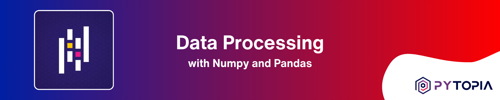
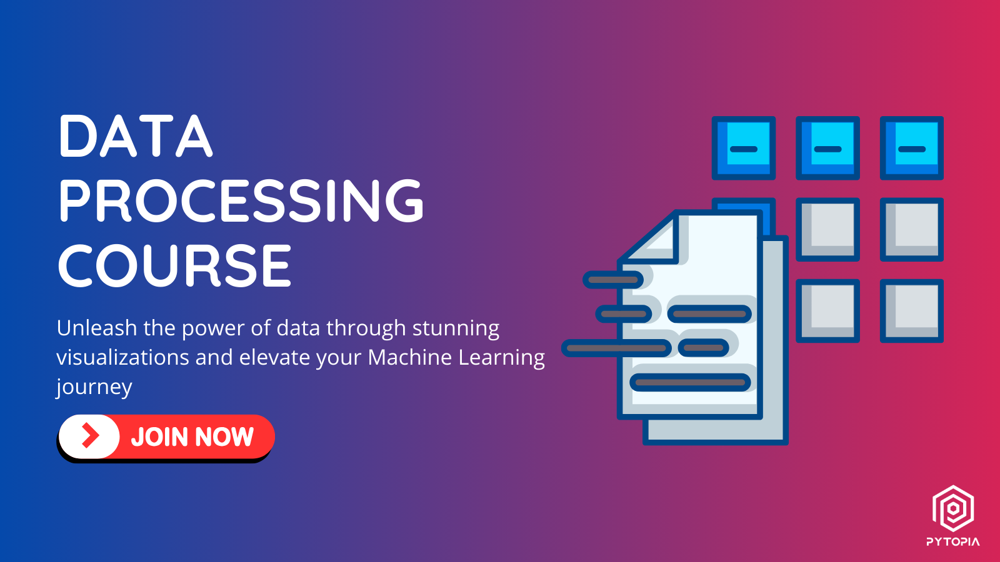

[](https://www.pytopia.ai)
[](https://t.me/pytopia_ai)
[](https://instagram.com/pytopia.ai)
[](https://www.youtube.com/@pytopia)
[](https://linkedin.com/company/pytopia)
[](https://twitter.com/pytopia_ai)

Welcome to the Data Processing for Machine Learning course repository! This hands-on course is designed to equip you with the essential skills and techniques for effectively processing and preparing data, which is a crucial step in any Machine Learning pipeline. Whether you're a beginner looking to dive into the world of data processing or an aspiring data scientist seeking to enhance your data manipulation skills, this course has something to offer.

# 🎯 Course Objectives

By the end of this course, you will:

- Understand the fundamental concepts and techniques of data processing
- Master the powerful Python libraries: NumPy and Pandas
- Learn various data cleaning, preprocessing, and transformation techniques
- Gain hands-on experience in exploring and analyzing real-world datasets
- Acquire skills in preparing data for Machine Learning tasks
- Apply your knowledge to practical data processing projects
- Discover the importance of data quality and its impact on Machine Learning models

# 📚 Course Contents

The course is divided into the following chapters:

1. Introduction to Data Processing
2. NumPy Fundamentals
3. Pandas Fundamentals
4. Data Cleaning and Preprocessing
5. Data Transformation and Manipulation
6. Advanced NumPy and Pandas Techniques
7. Data Exploration and Analysis
8. Real-world Applications and Case Studies
9. Preparing Data for Machine Learning
10. Course Projects

Each chapter includes a combination of theoretical explanations, practical examples, and hands-on exercises to reinforce your understanding of the concepts and their applications in real-world scenarios. The course emphasizes practical learning through real-world case studies and hands-on projects, allowing you to apply your data processing skills to solve authentic problems encountered in Machine Learning workflows.

# ✅ Prerequisites

To get the most out of this course, you should have:

- Basic knowledge of Python programming
- Familiarity with basic mathematical concepts
- Enthusiasm to learn and explore the fascinating world of data processing!

# 🚀 Getting Started

To get started with the course, follow these steps:

1. Clone this repository to your local machine using the following command:
   ```
   git clone https://github.com/pytopia/data-processing-for-ml.git
   ```

2. Navigate to the cloned repository:
   ```
   cd data-processing-for-ml-course
   ```

3. Set up the required dependencies and environment by following the instructions in the `setup.md` file.

4. Start exploring the course materials, beginning with the first chapter.

Throughout the course, you will gain a deep understanding of the essential data processing techniques and tools, such as NumPy and Pandas, which are widely used in the Machine Learning community. By working on real-world case studies and projects, you will develop the skills and confidence to tackle data processing challenges encountered in Machine Learning projects.

# 📚 Learn with Us!
We also offer a [course on these contents](https://www.pytopia.ai/courses/data-processing) where learners can interact with peers and instructors, ask questions, and participate in online coding sessions. By registering for the course, you also gain access to our dedicated Telegram group. Enroll now and start learning! Here are some useful links:

- [Machine Learning Course](https://www.pytopia.ai/courses/data-processing)
- [Pytopia Public Telegram Group](https://t.me/pytopia_ai)
- [Pytopia Website](https://www.pytopia.ai/)

[](https://www.pytopia.ai/courses/data-processing)

# 🚀 Getting Started

To get started with the course, follow these steps:

1. Clone this repository to your local machine using the following command:
   ```
   git clone https://github.com/your-username/data-processing-for-ml.git
   ```

2. Navigate to the cloned repository:
   ```
   cd data-processing-for-ml
   ```

3. Set up the required dependencies and environment by following the instructions in the `setup.md` file.

4. Start exploring the course materials, beginning with the first chapter.

Throughout the course, you will gain a deep understanding of the essential data processing techniques and tools, such as NumPy and Pandas, which are widely used in the Machine Learning community. By working on real-world case studies and projects, you will develop the skills and confidence to tackle data processing challenges encountered in Machine Learning projects.

# 📞 Contact Information

Feel free to reach out to us!

- 🌐 Website: [pytopia.ia](https://www.pytopia.ai)
- 💬 Telegram: [pytopia_ai](https://t.me/pytopia_ai)
- 🎥 YouTube: [pytopia](https://www.youtube.com/@pytopia)
- 📸 Instagram: [pytopia.ai](https://www.instagram.com/pytopia.ai)
- 🎓 LinkedIn: [pytopia](https://www.linkedin.com/in/pytopia)
- 🐦 Twitter: [pytopia_ai](https://twitter.com/pytopia_ai)
- 📧 Email: [pytopia.ai@gmail.com](mailto:pytopia.ai@gmail.com)
